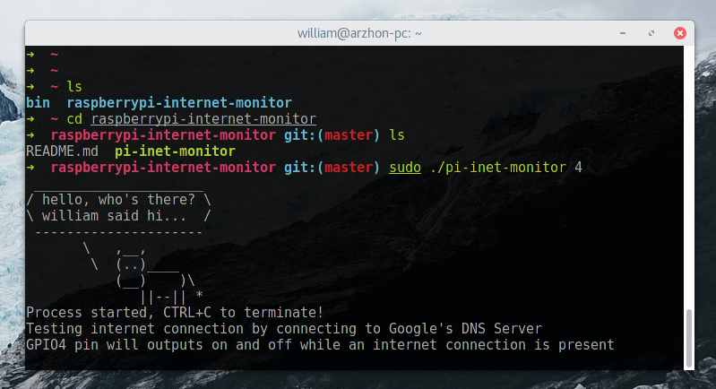

# raspberrypi-internet-monitor
Blinking GPIO output when a live internet connection is present

I usually setup an LED in one of the available GPIO pins, so it will blink as long as an internet connection is present on the pi

