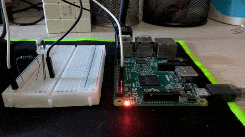

# raspberrypi-internet-monitor
Blinking GPIO output when a live internet connection is present

I usually setup an LED in one of the available GPIO pins, so it will blink as long as an internet connection is present on the pi

## Usage
```
$ pi-inet-monitor -h
usage: pi-inet-monitor [-h] GPIO_NUM

positional arguments:
  GPIO_NUM    The GPIO output pin number you want to use

optional arguments:
  -h, --help  show this help message and exit
```

## Preview



